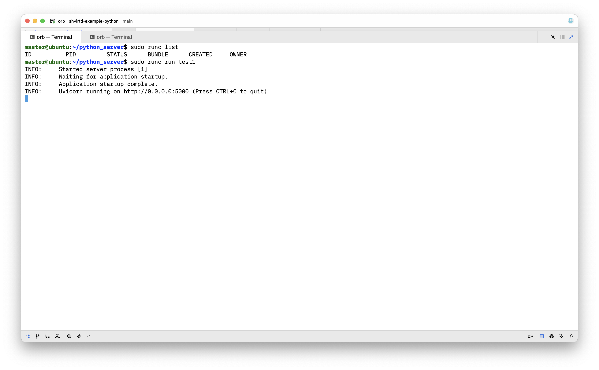
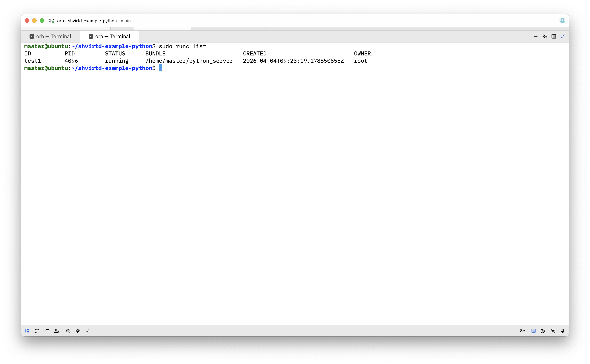

# Домашнее задание к занятию 5 «Практическое применение Docker» - Муравский Артем

1. Сделан [форк репозитория](https://github.com/acider19/shvirtd-example-python)

  Создан [Dockerfile](https://github.com/acider19/shvirtd-example-python/blob/main/Dockerfile.python)

2. [Container registry в Yandex Cloud](img/screen17.png)

  [Отчет о сканировании](csv/vulnerabilities.csv)

3. Создан [файл compose.yaml](https://github.com/acider19/shvirtd-example-python/blob/main/compose.yaml)

  Скриншот результата sql-запроса
  

4. Определен IP-адрес рабочего ноутбука на сервисе 2ip.ru
  

  Скриншот результата sql-запроса на ВМ в Yandex Cloud
  
  
  [Форк репозитория](https://github.com/acider19/shvirtd-example-python)

5. [Скрипт резервного копирования](https://github.com/acider19/shvirtd-example-python/blob/main/script.sh)
  
  Скриншот crontab
  
  
  Скриншот директории с резервными копиями
  

6. Скачиваем образ terraform локально на рабочий ноутбук, конвертируем docker образ в архив командой `docker image save -o terraform.tar.gz hashicorp/terraform`. Распаковываем архив.
  Скриншот выполнения команд
  
  
  С помощью утилиты dive анализируем образ `docker run -ti --rm -v /var/run/docker.sock:/var/run/docker.sock wagoodman/dive hashicorp/terraform`. Находим нужный слой, в котором находится бинарный файл `bin/terraform`.
  Скриншот интерфейса утилиты dive
  
  
  Находим в директории `blobs/sha256` архив с названием, соответствующим слою из предыдущего подпункта, распаковывваем архив и убеждаемся, что целевой файл `/bin/terraform` присутствует в файловой системе рабочего ноутбука.
  Скриншот выполнения команд
  

6.1 Запускаем контейнер `hashicorp/terraform`, он сразу же завершит свою работу, но это не мешает выполнить команду `docker cp c513ab0a620e:/bin/terraform ./terraform` и тем самым скопировать бинарный файл `bin/terraform` из файловой системы контейнера на хостовую файловую систему, убеждаемся, что файл присутствует.
  Скриншот выполнения команд
  

6.2 Для извлечения файла с помощью команды `docker build` создаем директорию `/home/master/cache` и выполним команду `docker build --target builder -o type=local,dest=/home/master/cache . -f Dockerfile.python`. Что в ней происходит: выполнение стандартного `docker build` из файла `Dockerfile.python`, но при этом кэш сборки (содержимое контейнера) сохраняется в локальной директории `/home/master/cache`, также директива `--target builder` указывает до какой стадии производить сборку, так как файлы каждого последующего этапа затирают файлы предыдущего.
  Скриншот выполнения команд
  
  
  Убеждаемся, что в директории `/home/master/cache` находятся все файлы из первого этапа multistage-сборки.
  Скриншот выполнения команды
  

7. Для запуска приложения использована информация из [официального репозитория runc](https://github.com/opencontainers/runc).
  
  Создаем директорию `python_server` и директорию `rootfs` в ней, убеждаемся, что она пустая. Далее выполняем экспорт содержимого образа `cr.yandex/crpj7bgsnkev2f05tsv9/python_server` в директорию `rootfs` с помощью команды `docker export $(docker create cr.yandex/crpj7bgsnkev2f05tsv9/python_server) | tar -C rootfs -xvf - &> /dev/null` и убеждаемся, что в директории `rootfs` появились файлы.
  Скриншот выполнения команд
  
  
  В директории `python_server` выполняем команду `runc spec` для генерирования дефолтного конфигурационного файла `config.json`.
  Скриншот выполнения команд
  
  
  Вносим изменения в конфигурационный файл `config.json`. В блоке `process` изменяем: 1) устанавливаем `terminal:false`; 2) меняем дефолтные значения `uid:0` и `guid:0` на `uid:501` и `guid:501`; 3) для `args` устанавливаем значение из директивы докерфайла `CMD` `"uvicorn", "main:app", "--host", "0.0.0.0", "--port", "5000"`; 4) для `env` добавляем `/app/venv/bin`; 5) для текущей директории устанавливаем для `cwd` значение `/app`.
  Скриншот отредактированного конфигурационного файла `config.json`
  
  
  Запускаем контейнер командой `sudo runc run test1`.
  Скриншот выполнения команд
  
  
  Проверяем наличие запущенных контейнеров командой `sudo runc list` и убеждаемся, что контейнер `test1` запущен.
  Скриншот выполнения команд
  
