# Домашнее задание к занятию 4 «Оркестрация группой Docker контейнеров на примере Docker Compose» - Муравский Артем

1. Образ собран и отправлен в репозиторий, доступен по ссылке [custom-nginx](https://hub.docker.com/r/acider19/custom-nginx)

---

2. Скриншот запуска команд
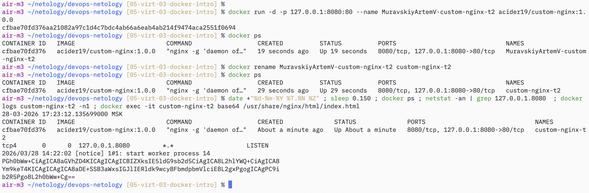
Скриншот открытой страницы web-сервера в браузере
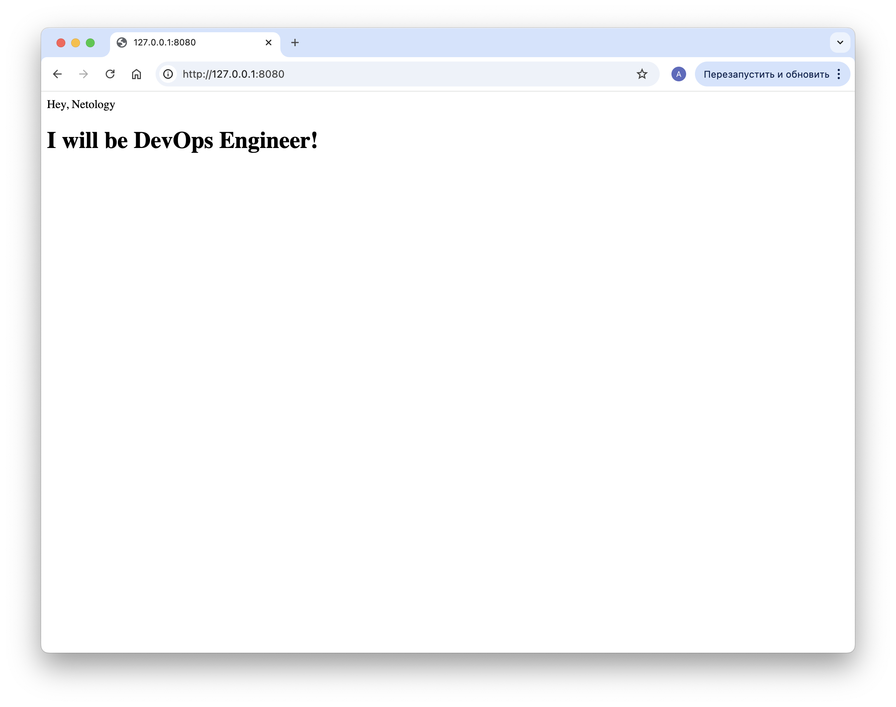

---

3. Скриншот подключения к стандартному потоку контейнера `custom-nginx-t2` и его остановка вследствии нажатия `Ctrl+C`.
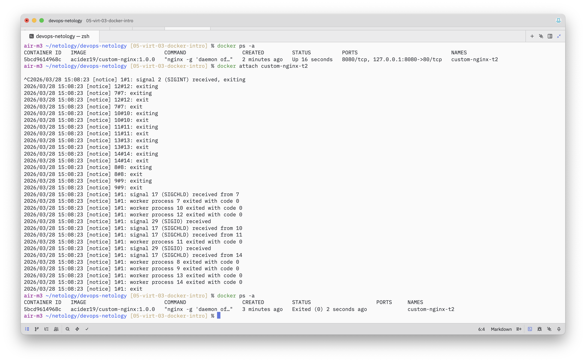

При сборке образа в качестве `entrypoint` был указан `nginx`, соответственно при запуске контейнера процесс `nginx` получил pid 1. При выполнении `docker attach` происходит подключение к стандартному потоку процесса, указанного в `entrypoint`. Остановка произошла потому, что сочетание `Ctrl+C` инициировало SIGINT, то есть корректное завершение этого процесса и всех его дочерних. В контейнере не осталось работающих процессов и он остановился.

Скриншот конфига nginx с измененным номером слушаемого порта
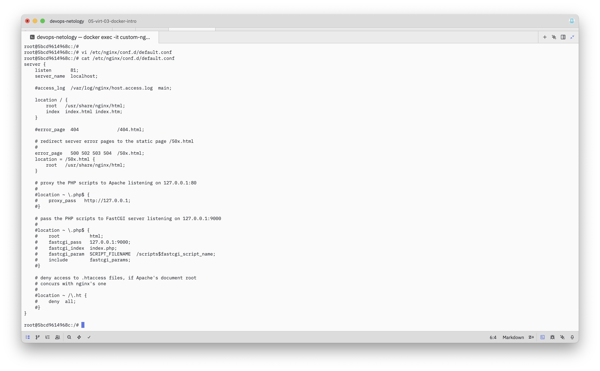

Скриншоты результатов работы команды `curl` в контейнере к web-серверам с разными портами (порт 81 активен)
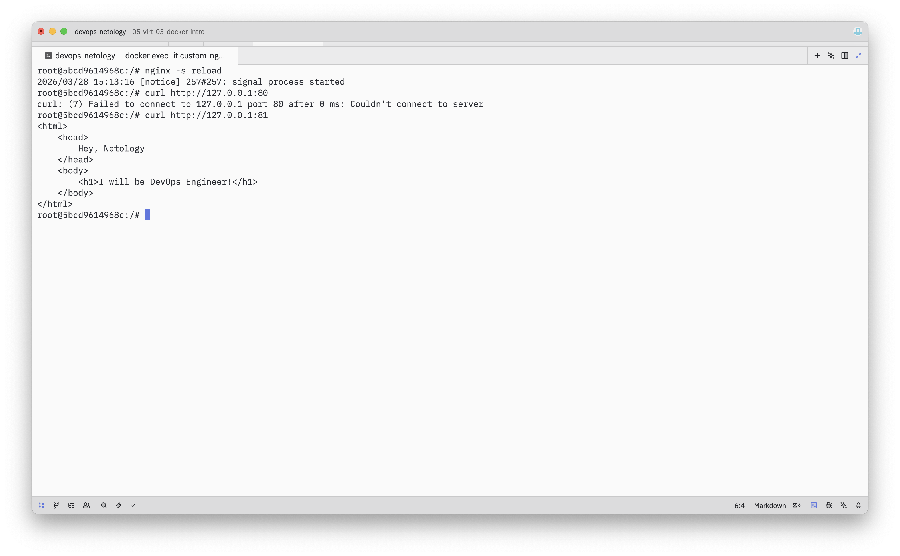

Скриншот выполнения команд на хосте после корректировки конфига `nginx`, видим что с портом `8080` хоста все в порядке (прослушивается, мапится на первоначальный порт контейнера, указанный при запуске), но ответ на запрос к web-серверу пустой. Это происходит потому, что на данном этапе nginx слушает уже порт `81` и проблема в некорректном сопоставлении портов хоста `8080` и контейнера `80`
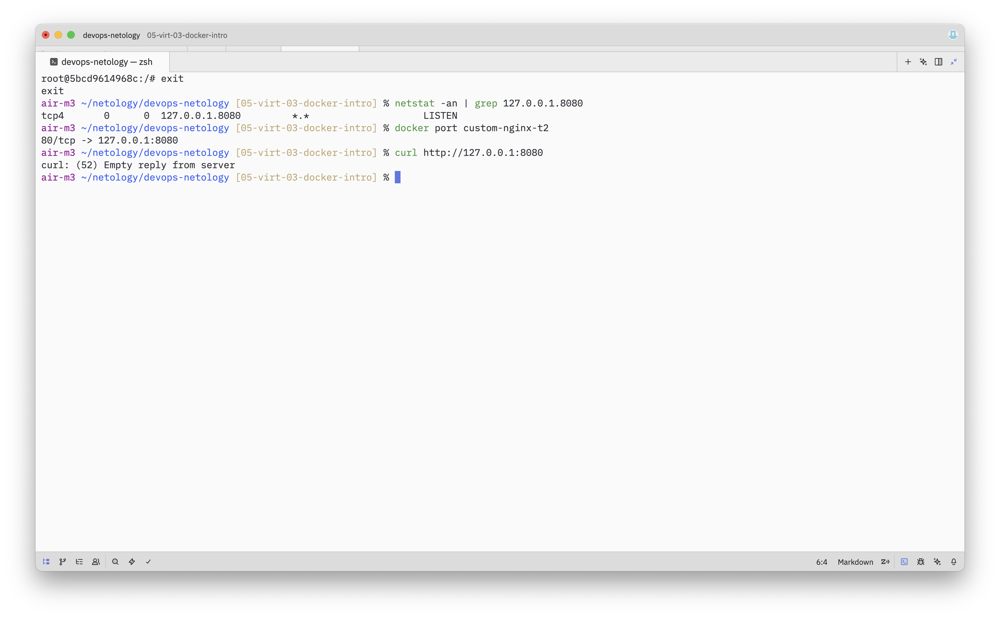

Скриншот исправления проблемы из предыдущего пункта и удаления запущенного контейнера одной командой
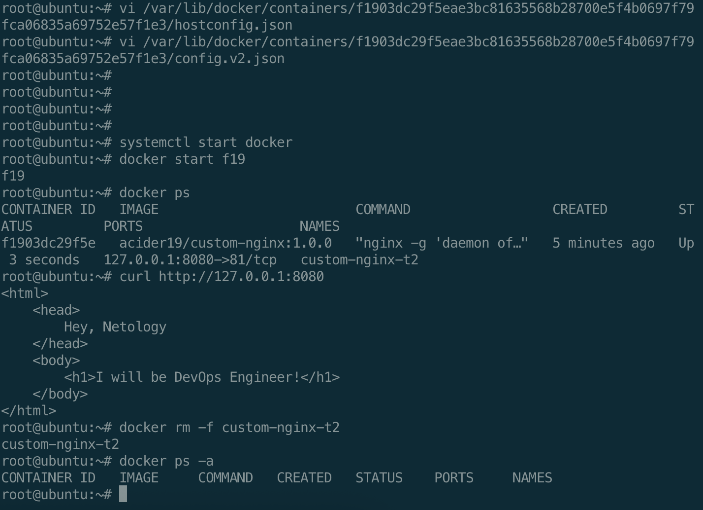

---

4. Скриншота запуска контейнеров `centos` и `debian` с требуемыми параметрами
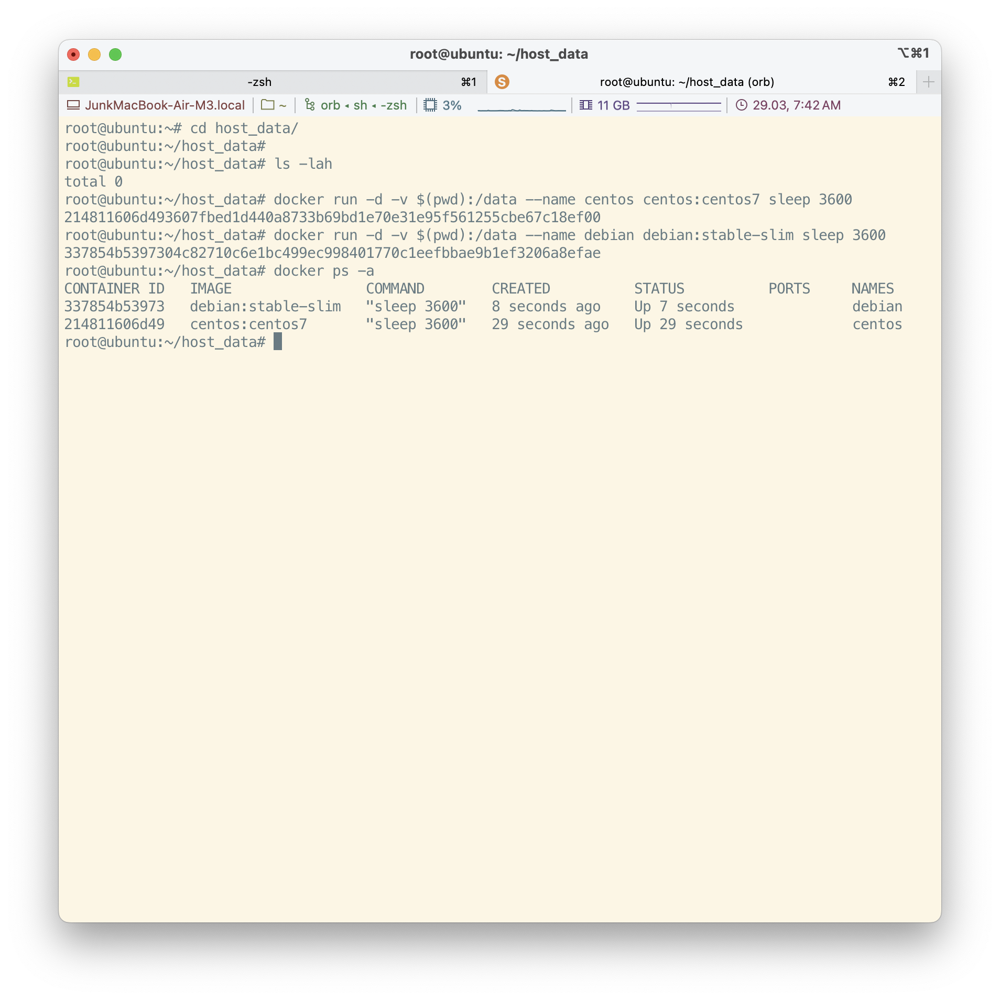

Скриншот с созданием текстовых файлов и контейнере `centos`, на хосте и просмотр их наличия в контейнере `debian`
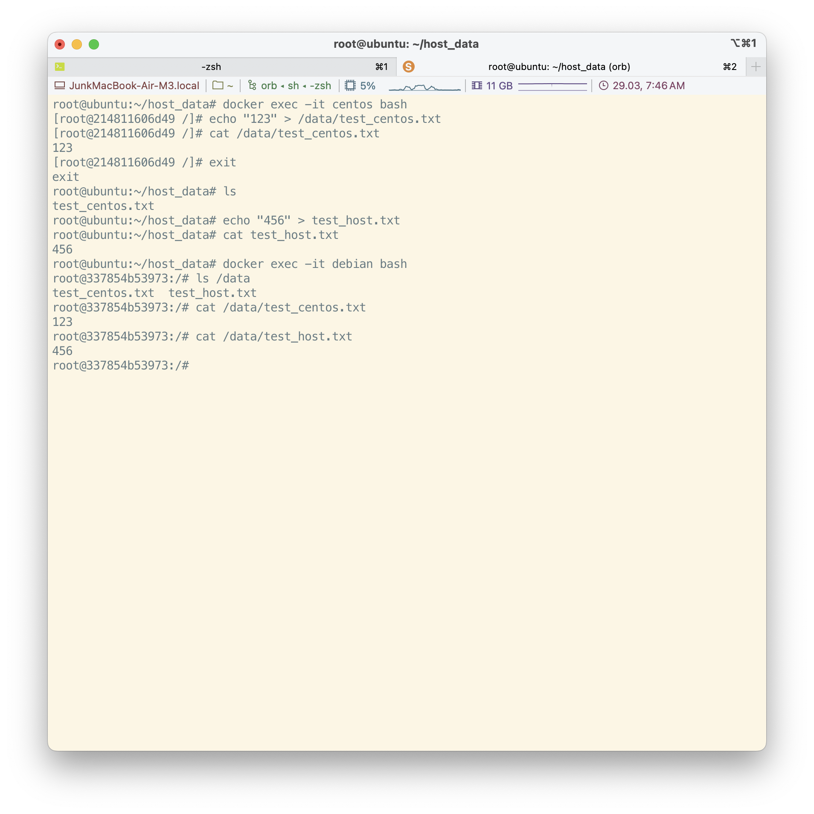

---

5. Скриншот запуска `docker compose`, видно, что автоматически запускается из файла `compose.yaml`, так как, судя по официальной документации, это название является более приоритетным, чем `docker-compose.yaml`, хотя оно тоже корректное и будет запускаться
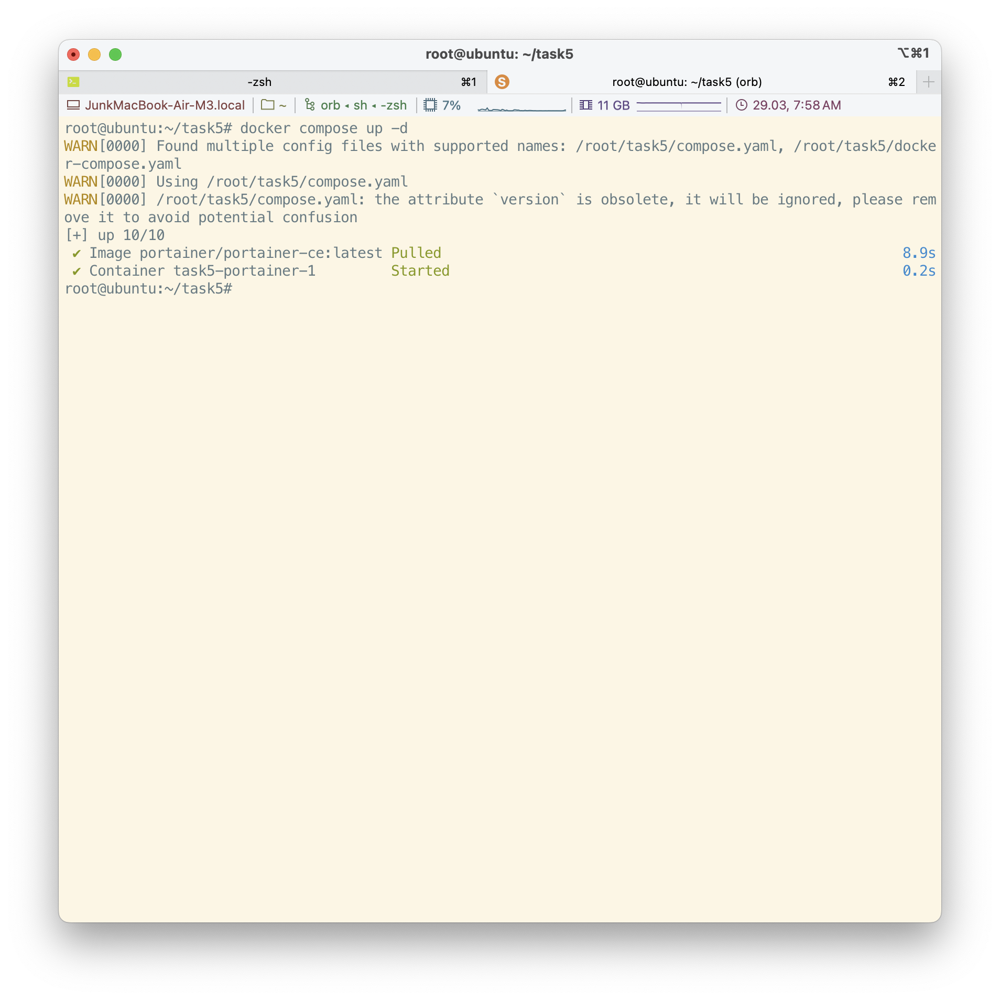

Скриншот запуска отредактированного `compose.yaml` (использование директивы `include` для обеспечения вложенного исполнения стороннего `docker-compose.yaml`)
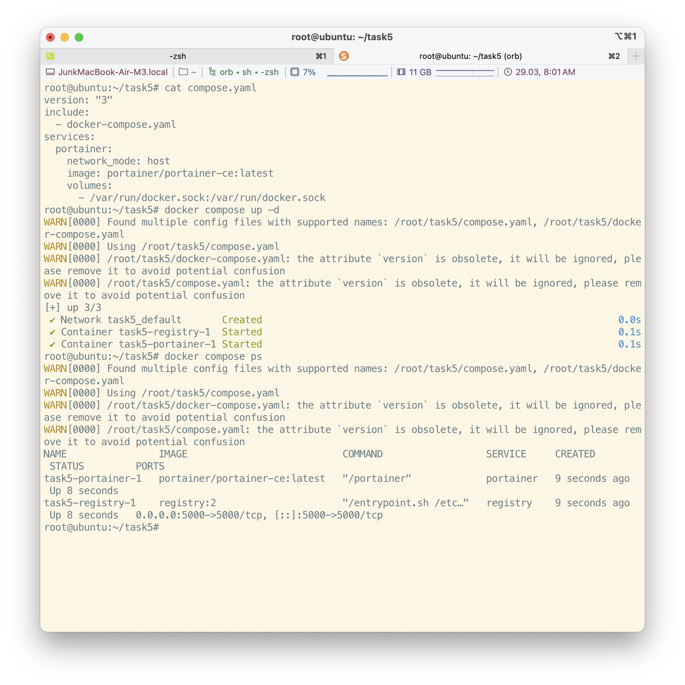

Скриншот размещения образа, созданного и помещенного в dockerhub, из пункта 1 в локальный docker registry
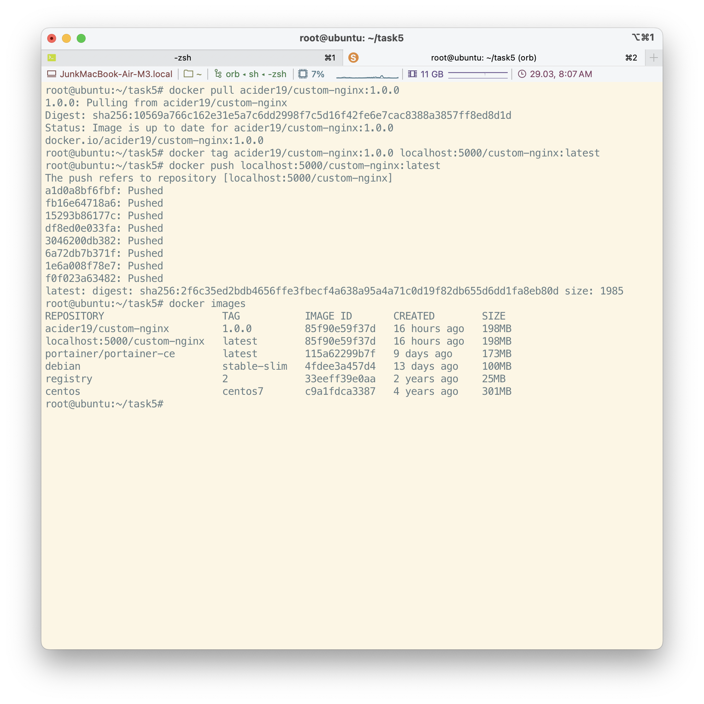

Скриншот запущенного в `portainer.io` контейнера `custom-nginx:latest`
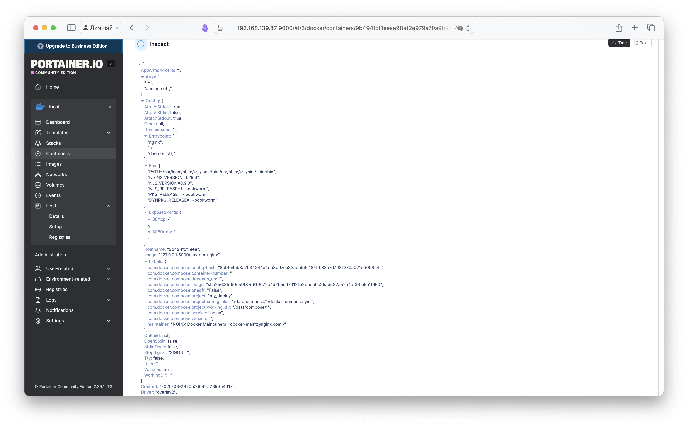

Скриншот удаления `compose.yaml` и перезапуска `docker compose up -d`, проблема "осиротевших" контейнеров (удаленных из конфига, но остающихся работать в системе) решается добавлением ключа `--remove-orphans`. Остановка `docker compose` одной командой 
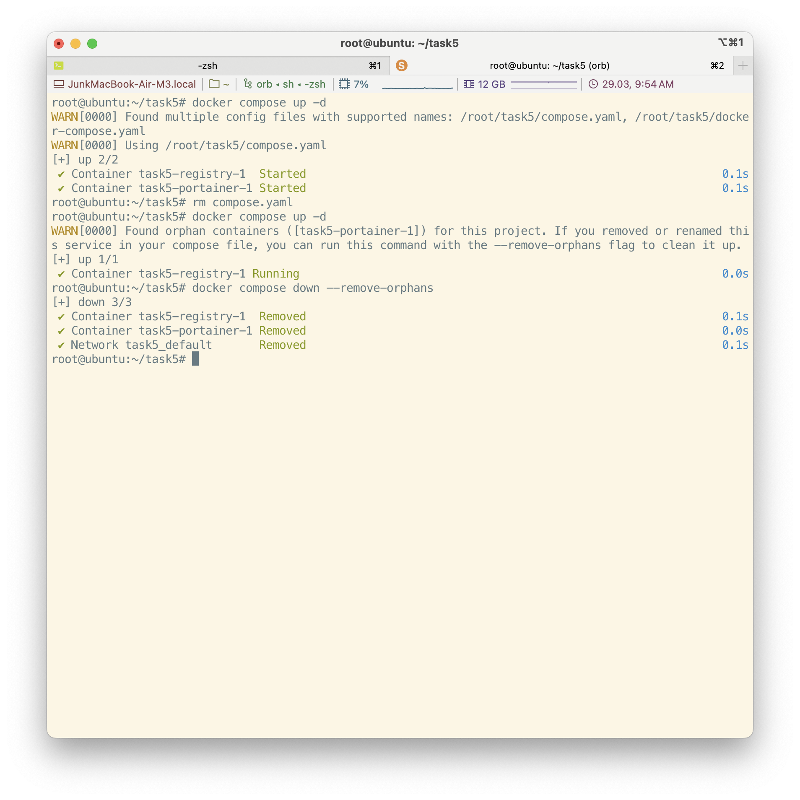
